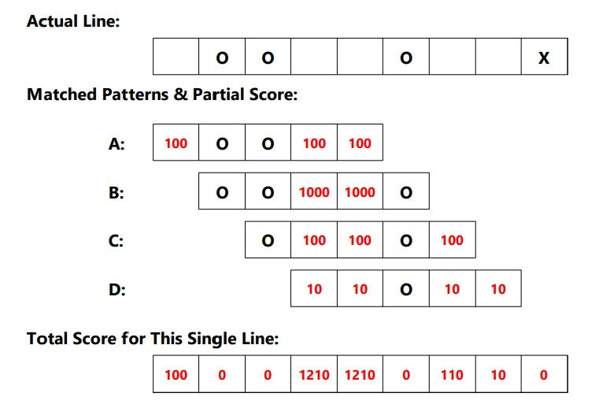

五目並べ
====

ブラウザで動く五目並べです。人間側がマスをクリックして入力すると、COM側が最善手を計算して返します。

## Description

Reactで動いています。COM側は次の手順で盤面評価値を計算します。

1. ゲーム開始時に、すべてのマッチングパターンを生成する。
    - 五目並べなら、`2*2*2*2*2 = 32`通り考えられる
1. 各パターンの空白マスにスコアを与える。
    - 五目並べで石が4つ揃っているパターンなら、その空白マスに10000点。3つ揃ってるパターンなら、1000点...という具合
1. 人間側が手を指して盤面が変化するたびに、Game ClassからBrain Classに盤面情報を投げる。
1. Brain Classでは、すべてのライン（縦、横、斜め）のすべての位置について上記のパターンマッチングを試みる。
1. マッチしたならば、各セルのスコアをスコア行列に加える。すべてのラインを計算したあとにスコア行列の中でスコアが最高の地点を最善手とする。
1. このスコア行列は、「O（人間側）にとってのスコア行列」「X（COM側）にとってのスコア行列」の２種類を考える必要がある。
    - 「人間側の最善手」の場所にコンピュータが石を置けば、人間側を妨害できる。（敵の打ちたいところに打て）
1. 「COM側にとっての最善手」に一定の係数を掛けた上で、「人間側にとってのスコア行列」に加算する。この合算スコア行列の中で値が最高の地点にCOM側は石を置く。
    - これにより、人間側のスコアが高い場合（石が４つ並んでおり王手のときなど）のみCOM側が人間側を妨害する手を選択するようになるはず。

盤面の中に上記のようなラインがあったとして、これにパターンマッチングをすると、A, B, C, Dの４パターンがマッチする。パターン配列の空白の部分には固定でスコアを割り振っているので、これら４パターンについてスコアを合算する。多くのパターンがマッチする空白セル、完成に近い箇所の空白セルほどスコアが高くなる。

## Usage

`npm start`後にブラウザを開けば動きます。

## Requirements

`package.json`を参照

## Todo 

- 見た目があまりに地味なので、アニメーションをつける
- 最後に指した手を別の色で表示する
- COM側の強さを選べるようにする
- プレイを記録し、サーバー等に保存する（特にCOM側が負けた場合のデータが重要）
- 人間側が「待った」を使えるようにする
- スコアのつけ方を改善する：今は総当たりだが、機械学習などで改善の余地がある。
    - 現在は各パターン内部の各空白セルのスコアに適当な固定値を割り振っているが、これが最良だとは思えない。（スコア100点ではなく95点の方が良い、とか）
    - COM側の意図が人間側プレイヤーにバレると、その手は人間側につぶされてしまう。「人間側から見て気付きにくい石の置き方」があるはずだが、現状ではこれを学習していく術がない
    - 「指した手がCOM側の勝利に結びついたかどうか」を教師データとして、パターンのスコア値を増減させることができるか？
    - 場面全体を画像のようにCNNに投げれば学習できることができるのか？
        - 深層学習といえどもそこまで賢くはなさそうだが・・・
- 好戦度（自分の手を作るのを優先するか、人間側を邪魔するのを優先するのか）の計算方法がよくない
    - 現時点では単純に両者のスコアを足しているが、人間側が王手なのにCOM側がそれを無視し自分の手を優先させてしまったために敗北する時がある。単純に加算するのではなく、両者のスコア行列の最大値同士を比較すべきかもしれない。
- Brain.jsのコードが長すぎるし見にくすぎて地獄のようになっている
    - 十分にオブジェクト指向的ではない。クラス分割、ファイル分割、関数分割すべき
- 盤面評価値の計算方法は我流で考えた原始的なものなので、もっとうまい方法もあるはず
    - 将棋の評価関数計算方法とかを勉強したほうがいいかも？
